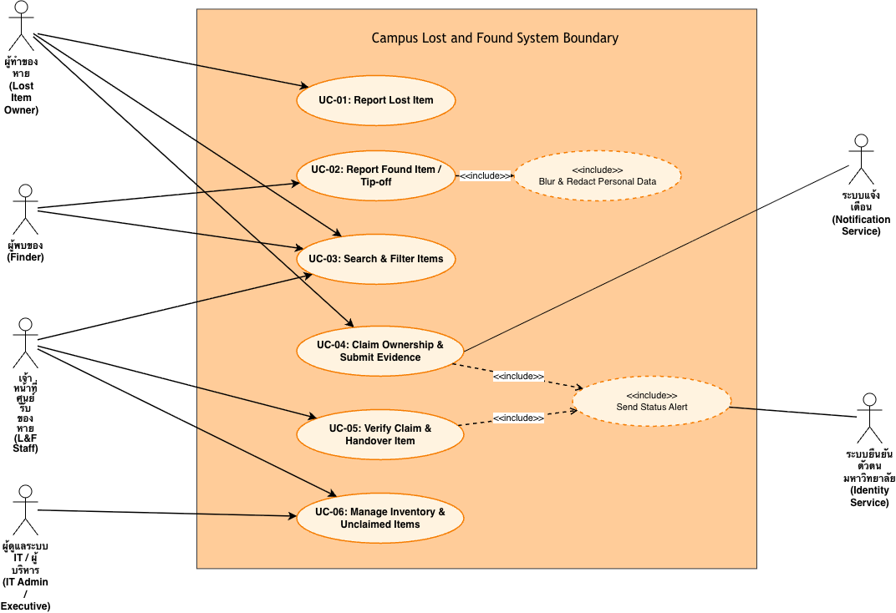

# Use Case Diagrams: Campus Lost and Found

ไดอะแกรม Use Case แสดงปฏิสัมพันธ์ระหว่าง Actors กับความสามารถของระบบในขอบเขต Campus Lost and Found (Case-05)

## 1. Use Case Diagram

## 2. รายการ Use Case และการเชื่อมโยง Requirement

| Use Case ID | ชื่อ Use Case | Primary Actor | เชื่อมโยง Requirement | รายละเอียดในเอกสาร |
|---|---|---|---|---|
| **UC-01** | Report Lost Item | ผู้ทำของหาย | `FR-CLF-02` | [06-requirement-models.md](../../docs/06-requirement-models.md#3-use-case-list) |
| **UC-02** | Report Found Item / Tip-off | ผู้พบของ | `FR-CLF-03`, `BR-CLF-01` | [06-requirement-models.md](../../docs/06-requirement-models.md#uc-02--report-found-item--tip-off--privacy-handling-แจ้งพบของแจ้งเบาะแส) |
| **UC-03** | Search & Filter Found Items | ผู้ใช้งานทั่วไป | `FR-CLF-06`, `BR-CLF-01` | [06-requirement-models.md](../../docs/06-requirement-models.md#3-use-case-list) |
| **UC-04** | Claim Ownership & Submit Evidence | ผู้ทำของหาย | `FR-CLF-04`, `NFR-CLF-01` | [06-requirement-models.md](../../docs/06-requirement-models.md#uc-04--claim-ownership--submit-evidence-ยื่นคำร้องและส่งหลักฐานยืนยันเจ้าของ) |
| **UC-05** | Verify Claim & Handover Item | เจ้าหน้าที่ศูนย์รับของหาย | `FR-CLF-01`, `FR-CLF-05` | [06-requirement-models.md](../../docs/06-requirement-models.md#uc-05--verify-claim--handover-item-ตรวจสอบสิทธิ์และส่งมอบสิ่งของคืน) |
| **UC-06** | Manage Inventory & Unclaimed Items | เจ้าหน้าที่ศูนย์รับของหาย | `FR-CLF-01`, `FR-CLF-08` | [06-requirement-models.md](../../docs/06-requirement-models.md#3-use-case-list) |

## 3. Checklist คุณภาพ

- [x] ทุก Use Case มี Primary Actor กำหนดชัดเจน
- [x] ขอบเขตระบบ (System Boundary) แยกชัดระหว่าง Actors ภายใน/ภายนอก
- [x] มีความสัมพันธ์ `<<include>>` สำหรับฟังก์ชันที่ต้องทำเสมอ (Blur/Redact, Notification)
- [x] เชื่อมโยงกับรหัสความต้องการใน Baseline v1.0 ครบถ้วน
