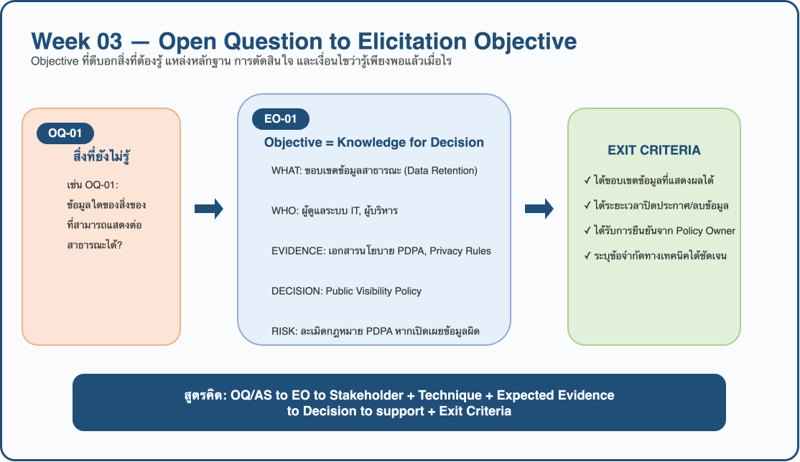
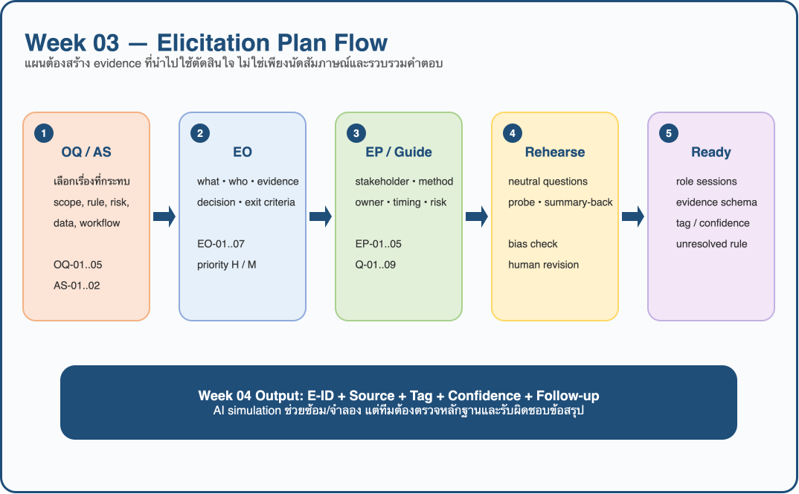

# Week 03 — Elicitation Plan

> **Team:** Group05  
> **Case:** Campus Lost and Found (ระบบแจ้งของหาย-พบของในมหาวิทยาลัย)  
> **Assignment:** `W03-v2.0`  
> **Version:** v1.0 — Remastered Elicitation Plan  
> **Inputs:** Week 02 `OQ-01..OQ-05`, `AS-01..AS-02`, `EP-01..EP-05`

---

## 1. Planning Intent

แผนนี้เปลี่ยนประเด็นที่ทีม “ยังไม่รู้” (Open Questions และ Assumptions จาก Week 02) ให้เป็น **Elicitation Objectives (EO)** ที่วัดผลและตรวจสอบจบได้ จากนั้นระบุกลุ่ม Stakeholders, เทคนิคการเก็บข้อมูล (Elicitation Methods), หลักฐานที่คาดหวัง (Expected Evidence), ผู้รับผิดชอบ (Owner), ความเสี่ยง (Risk) และเงื่อนไขการผ่าน (Exit Criteria) เพื่อเตรียมพร้อมสำหรับ Week 04 Simulation / Stakeholder Panel



---

## 2. Open Question → Elicitation Objective

| EO ID | Source OQ/AS | Objective: ต้องรู้อะไร | จากใคร/แหล่งใด | ใช้ตัดสินใจเรื่องใด | Exit criteria |
|---|---|---|---|---|---|
| EO-01 | OQ-01 | ข้อมูลใดของสิ่งของที่สามารถแสดงต่อสาธารณะได้ และเมื่อใดที่ควรปิดประกาศ | ผู้ดูแลระบบ IT, ผู้บริหาร; เอกสารนโยบาย PDPA | Data Retention, Public Visibility Policy และ privacy rules | ได้ขอบเขตข้อมูลที่แสดงผลได้ และระยะเวลาปิดประกาศ/ลบข้อมูลที่ชัดเจน |
| EO-02 | OQ-02 | ปัจจุบันมีวิธียืนยันตัวตนเจ้าของอย่างไร และจะยืนยันเจ้าของได้อย่างไรให้ปลอดภัย | เจ้าหน้าที่ศูนย์รับของหาย, ผู้ทำของหาย | Workflow การส่งมอบของคืน และระบบยืนยันสิทธิ์ความเป็นเจ้าของ | ได้เกณฑ์การขอดูหลักฐาน และลำดับขั้นตอนการอนุมัติส่งคืนของ |
| EO-03 | OQ-03 | มีแนวทางการคัดกรองรูปภาพ (Image moderation) เพื่อซ่อนข้อมูลสำคัญอย่างไรบ้าง | ผู้ดูแลระบบ IT, ผู้บริหาร | Image Moderation Feature, Role-based Access Control | ได้นโยบายการปกปิดภาพ และเลือกทางเลือกระหว่าง AI Censor vs เจ้าหน้าที่ตรวจ |
| EO-04 | OQ-04 | ของประเภทใดที่ผู้พบต้องนำมาส่งให้เจ้าหน้าที่ทันที ห้ามโพสต์หาเจ้าของเอง | เจ้าหน้าที่ศูนย์รับของหาย, ผู้บริหาร | Rule-based Item Classification และเงื่อนไขสิ่งของควบคุม | ได้รายการประเภทสิ่งของควบคุมที่ต้องยึดเข้าศูนย์ส่วนกลางทันที |
| EO-05 | OQ-05 | ขั้นตอนการส่งมอบของคืนที่สถานีรับของหายโดยละเอียด และการจัดการของตกค้าง | เจ้าหน้าที่ศูนย์รับของหาย, ผู้บริหาร | Physical Item Management Workflow และ Unclaimed Items Policy | ได้ Flow การบันทึกรับเข้า-จ่ายออก และแนวทางจัดการของตกค้างระยะยาว |
| EO-06 | AS-01 | ตรวจสอบพฤติกรรมจริงของผู้พบของ ความยินดีและอุปสรรคในการนำของมาส่งที่ศูนย์ | นักศึกษา (กลุ่มผู้พบของ) | User Flow การแจ้งเบาะแส และช่องทางการส่งมอบของ | ได้ข้อสรุปพฤติกรรมจริงในอดีต (Past behavior) และอุปสรรคของผู้พบของ |
| EO-07 | AS-02 | ประเมินระดับความกังวลด้านความเป็นส่วนตัว (Privacy) ของผู้ทำของหาย | นักศึกษา (กลุ่มผู้ทำของหาย) | Value Proposition ของระบบส่วนกลางเทียบกับโซเชียลมีเดีย | ได้ระดับความพึงพอใจและปัจจัยการยอมรับการใช้ระบบส่วนกลาง |

### Prioritization

- **High Priority (EO-01, EO-02, EO-03):** กระทบโดยตรงต่อ Security, กฎหมาย PDPA และการป้องกันมิจฉาชีพสวมรอยรับของมูลค่าสูง
- **Medium Priority (EO-04, EO-05, EO-06, EO-07):** กระทบต่อ User Experience, ภาระงานกายภาพของเจ้าหน้าที่ และการยอมรับใช้งานระบบ (System Adoption)

---

## 3. Elicitation Plan



| EP ID | Target EO | Stakeholder / Source | Method | Expected Evidence | Owner / Roles | Timing | Risk → Mitigation |
|---|---|---|---|---|---|---|---|
| EP-01 | EO-02, EO-04, EO-05 | เจ้าหน้าที่ศูนย์รับของหาย | Semi-structured interview + Workflow walkthrough / Simulation | ลำดับงานจริงในการรับเข้า-ส่งคืนของ, เกณฑ์ยืนยันตัวตนปัจจุบัน, รายการสิ่งของควบคุม | ธนรัก: Interviewer<br>นรบดี: Note-taker | Week 03-04 Simulation | เสี่ยงได้คำตอบกว้าง → เตรียม Scenario จำลองการคืนของมูลค่าสูงเพื่อให้เห็น Flow จริง |
| EP-02 | EO-01, EO-03 | ผู้ดูแลระบบ IT | Technical Interview + Policy / Constraint check | นโยบาย Data Retention, ขอบเขต Image moderation และข้อจำกัดความปลอดภัย | ธนรัก: Interviewer<br>นรบดี: Note-taker | Week 03-04 Simulation | เสี่ยงใช้ศัพท์เทคนิคมากเกินไป → ถามเน้นผลกระทบต่อ Business Flow ก่อนลงลึกเชิงเทคนิค |
| EP-03 | EO-06, EO-07 | นักศึกษา (ผู้ทำของหาย / ผู้พบของ) | Interview + Scenario validation | พฤติกรรมจริงในอดีต (Past behavior), อุปสรรคด้านความสะดวก/เวลา, ความกังวลเรื่อง Privacy | ธนรัก: Interviewer<br>นรบดี: Note-taker | Week 03-04 Simulation | เสี่ยงผู้ใช้เสนอ Solution แทนปัญหา → ดึงกลับมาถามพฤติกรรมในอดีตแทนการถามถึงแอปในฝัน |
| EP-04 | EO-01, EO-03, EO-05 | ผู้บริหาร / ผู้กำหนดนโยบาย | Interview + Document analysis | นโยบายจัดการข้อมูลส่วนบุคคลสถาบัน และแนวทางจัดการสิ่งของตกค้าง (Unclaimed items) | ธนรัก: Interviewer<br>นรบดี: Note-taker | Week 03-04 Simulation | เสี่ยงนโยบายมีช่องโหว่ (Grey area) → เตรียมยกตัวอย่าง Edge cases ไปถามเพื่อให้ได้แนวทางปฏิบัติที่ชัดเจน |
| EP-05 | ทุก EO | ทีมงาน Group 05 | Workshop / Evidence triangulation | ข้อขัดแย้งของความต้องการ (Conflict of Interest), ข้อยกเว้น, และรายการคำถามที่ยังไม่อนุมัติ | ธนรัก & นรบดี | หลังจบ Simulation | เสี่ยงสรุปความต้องการเร็วเกินไป → แยก Fact, Opinion, AS และ PS ออกจากกันอย่างเด็ดขาด |

### Technique Selection Rationale

- **Why Interview?** เหมาะกับการเจาะลึกเหตุผล ประสบการณ์ และความกังวลที่แท้จริงของผู้ใช้ เช่น อุปสรรคที่ทำให้นักศึกษาไม่นำของไปส่งที่ศูนย์ (EO-06) หรือการสอบถามวิธียืนยันตัวตนเพื่อคืนของมีค่าจากเจ้าหน้าที่ (EO-02)
- **Why Document Analysis?** คำถามเกี่ยวกับกฎหมาย PDPA หรือนโยบายการจัดการสิ่งของตกค้าง (EO-01, EO-05) จำเป็นต้องอิงจากเอกสารนโยบายที่เป็นลายลักษณ์อักษร เพื่อลดความคลาดเคลื่อนจากความคิดเห็นส่วนตัว
- **Why Workflow Walkthrough / Simulation?** งานรับฝากและส่งคืนสิ่งของเป็นกิจกรรมทางกายภาพ การให้เจ้าหน้าที่เล่าหรือจำลองสถานการณ์จริง (เช่น มีคนมารับโทรศัพท์มือถือที่หาย) จะช่วยเปิดเผยข้อจำกัดและกระบวนการที่อาจหลงลืมไปได้
- **Why not Questionnaire as main technique now?** Questionnaire เหมาะกับการเก็บข้อมูลจากคนจำนวนมาก แต่ในระยะเริ่มต้นทีมต้องเข้าใจ Workflow และกฎเชิงลึกก่อน จึงเลือก Interview และ Simulation เป็นแกนหลัก

---

## 4. Evidence Capture Design & Interview Guide

### 4.1 Evidence Capture Schema & Tags

โครงสร้างการจดบันทึกในสังเกตการณ์/สัมภาษณ์:
```text
E-ID | Source/Role | Session/Context | Statement or Observation
Tag | Related EO/OQ | Confidence | Interpretation | Follow-up/Owner
```

| Tag | Meaning | ตัวอย่างในกรณีศึกษา Lost & Found |
|---|---|---|
| `CF` | Case Fact | ปัจจุบันไม่มีระบบส่วนกลางในการบันทึกข้อมูลของหาย-พบของ |
| `SN` | Simulated Need | เจ้าหน้าที่ต้องการระบบบันทึกรับเข้า-จ่ายออกที่ตรวจสอบย้อนหลังได้ |
| `CT` | Constraint | ห้ามเปิดเผยข้อมูลส่วนบุคคลหรือภาพถ่ายที่ไม่เซ็นเซอร์สู่สาธารณะตามกฎหมาย PDPA |
| `OP` | Opinion | “อยากให้ระบบส่งการแจ้งเตือนผ่านแอป LINE” |
| `AS` | Assumption | นักศึกษายินดีเดินเอาของไปส่งที่ศูนย์รับของหายหากทราบพิกัดจุดรับฝาก |
| `PS` | Proposed Solution | ใช้ระบบสแกน QR Code หรือระบบ AI ช่วยเซ็นเซอร์รูปภาพอัตโนมัติ |
| `OQ` | Open Question / Unresolved | ระยะเวลาที่ถือว่าสิ่งของนั้นกลายเป็น "ของตกค้าง" ยังไม่มีระเบียบชัดเจน |

### 4.2 Interview Questions Protocol

| Question ID | Target Role | Main / Follow-up Question | Type | Why Asked | Target EO / OQ | Expected Evidence |
|---|---|---|---|---|---|---|
| **Q-01** | เจ้าหน้าที่ | ปัจจุบันเมื่อมีคนนำของที่เก็บได้มาส่ง หรือมีคนมาติดต่อขอรับของคืน มีขั้นตอนดำเนินการอย่างไรตั้งแต่ต้นจนจบ? | Open | เพื่อเข้าใจ Workflow ปัจจุบันโดยไม่พูดถึงระบบใหม่ และหาช่องโหว่ในการทำงาน | EO-05 (OQ-05) | ขั้นตอนการรับเข้า/จ่ายออก, วิธีการบันทึกข้อมูล |
| **Q-02** | เจ้าหน้าที่ | จากขั้นตอนที่เล่ามา จุดไหนที่คิดว่าใช้เวลามากที่สุด หรือทำให้เกิดข้อผิดพลาดบ่อยที่สุดในการทำงานปัจจุบัน? | Probe | เพื่อหา Pain point ที่แท้จริงของฝั่งเจ้าหน้าที่ผู้ปฏิบัติงาน | EO-05 (OQ-05) | ปัญหาคอขวด เช่น การค้นหาของในตู้ หรือการตอบคำถามซ้ำๆ |
| **Q-03** | เจ้าหน้าที่ | กรณีที่เป็นของมีค่า (เช่น โทรศัพท์, กระเป๋าสตางค์) มีวิธียืนยันตัวตนผู้มารับอย่างไรให้มั่นใจว่าไม่ใช่มิจฉาชีพ? ขอตัวอย่างเหตุการณ์จริงที่เคยเจอได้ไหมครับ? | Open / Probe | เพื่อนำมาออกแบบกระบวนการคืนของให้รัดกุม ป้องกันการสวมรอย | EO-02 (OQ-02) | เกณฑ์การขอดูหลักฐาน, ลำดับการอนุมัติคืนของ |
| **Q-04** | เจ้าหน้าที่ / ผู้บริหาร | หากมีของตกค้างที่ไม่มีคนมารับเกินระยะเวลาที่กำหนด ปัจจุบันมหาวิทยาลัยมีกฎหรือแนวทางในการจัดการของเหล่านั้นอย่างไร? | Open | เพื่อหาขอบเขตของระบบว่าต้องครอบคลุมกระบวนการจัดการของตกค้าง (Unclaimed items) หรือไม่ | EO-05 (OQ-05) | นโยบายทำลาย, บริจาค, หรือระยะเวลาจัดเก็บสูงสุด |
| **Q-05** | ผู้บริหาร / เจ้าหน้าที่ | มีของประเภทใดบ้างที่มีกฎชัดเจนว่า "ผู้พบต้องนำมาส่งให้เจ้าหน้าที่ทันที" ห้ามผู้พบโพสต์หาเจ้าของและเก็บไว้เอง? | Closed / Probe | เพื่อกำหนดเงื่อนไข (Rule-based) ในการจำแนกประเภทสิ่งของในระบบ | EO-04 (OQ-04) | รายการสิ่งของควบคุม (เช่น บัตร ปชช., กุญแจรถ, ของมีค่า) |
| **Q-06** | ผู้ดูแล IT / ผู้บริหาร | ในมุมมองของการจัดการข้อมูล ข้อมูลใดของสิ่งของหรือภาพถ่ายที่ไม่ควรแสดงสู่สาธารณะ ปัจจุบันมีนโยบายหรือวิธีจัดการเรื่องนี้อย่างไร? | Open | เพื่อวางแผนทำ Image Moderation และป้องกันการละเมิด PDPA | EO-01, EO-03 (OQ-01, OQ-03) | นโยบายการเซ็นเซอร์ข้อมูลส่วนบุคคล, กฎ Data Retention |
| **Q-07** | ผู้พบของ | ขอให้เล่าเหตุการณ์ล่าสุดที่คุณบังเอิญเจอของคนอื่นตกอยู่ คุณจัดการกับของชิ้นนั้นอย่างไร อะไรคือสาเหตุหลักที่ทำให้คุณตัดสินใจนำหรือไม่นำของไปฝากที่จุดรับฝาก? | Open | เพื่อตรวจสอบข้อสมมติ (Assumption) ว่าผู้ใช้ยินดีเอาของไปส่งจริงหรือไม่ หากมีอุปสรรคคืออะไร | EO-06 (AS-01) | พฤติกรรมจริงในอดีต (Past behavior), อุปสรรคด้านความสะดวก/เวลา |
| **Q-08** | ผู้ทำของหาย | ตอนที่คุณทำของหายครั้งล่าสุด คุณมีวิธีตามหาอย่างไร สิ่งที่คุณกังวลที่สุดระหว่างที่ยังหาของไม่เจอคืออะไร? | Open | เพื่อดูพฤติกรรมการค้นหาปัจจุบัน และประเมินระดับความกังวลด้าน Privacy | EO-07 (AS-02) | ช่องทางที่ใช้ตามหา, ความกลัวข้อมูลส่วนตัวหลุด |
| **Q-09** | ผู้ทำของหาย / เจ้าหน้าที่ | ในกรณีที่ผู้ทำของหายไม่สามารถเดินทางมาติดต่อขอรับสิ่งของคืนด้วยตนเองได้ ปัจจุบันมีหลักเกณฑ์หรือแนวปฏิบัติอย่างไรในการตรวจสอบเอกสาร/การมอบอำนาจ เพื่อป้องกันการแอบอ้างสวมรอยรับของแทน? | Open / Probe | เพื่อหาข้อกำหนดในการยืนยันตัวตนกรณีการมอบอำนาจและป้องกันมิจฉาชีพสวมรอย | EO-02 (OQ-02) | หลักเกณฑ์การมอบอำนาจ, เอกสารยืนยันตัวตนกรณีรับแทน |
| **Q-10** | ทุกคน (Validation) | "จากที่เราได้พูดคุยกันมาทั้งหมด ทีมงานขออนุญาตสรุปเพื่อทวนความเข้าใจนะครับ... ตรงนี้มีจุดไหนที่ทางเราเข้าใจคลาดเคลื่อน หรือมีข้อเสนอแนะ/ข้อควรระวังเพิ่มเติมไหมครับ?" | Validation | เพื่อให้แน่ใจว่าทีมตีความสิ่งที่ Stakeholder สื่อสารได้ถูกต้อง และเปิดโอกาสให้เขาเสริมประเด็นที่ตกหล่น | All EOs | คำยืนยันจาก Stakeholder (Confirmation) หรือข้อมูลใหม่ |

### 4.3 Anti-Bias Controls & Question Rehearsal Revisions

#### Team Assumptions & Mitigations

1. **ผู้พบของยินดีนำของไปส่งที่ศูนย์ฯ:** ถาม Q-07 เจาะลึกพฤติกรรมจริงในอดีต (Past behavior) แทนการถามถึงแอปในฝัน
2. **ผู้ทำของหายกังวลเรื่อง Privacy มากกว่าการได้ของคืนรวดเร็ว:** ถาม Q-08 ประเมินความกังวลด้าน Privacy เทียบกับความเร่งด่วนในการตามหาของ
3. **เจ้าหน้าที่มีเวลาคัดกรองรูปภาพด้วยตนเอง:** ถาม Q-01, Q-02 ดูปริมาณงานปัจจุบัน และถาม IT (Q-06) ถึงความพร้อมการใช้ระบบคัดกรองอัตโนมัติ
4. **ของทุกชิ้นสามารถถ่ายรูปโพสต์สาธารณะได้ทันที:** ถาม Q-05 หากฎเกณฑ์สิ่งของควบคุมที่ห้ามโพสต์สาธารณะ

#### Leading Question Revisions

| Original Leading Question | Why Problematic | Revised Non-Leading Question |
|---|---|---|
| *"ระบบจดบันทึกรับของหายในสมุดทำให้ทำงานช้าและวุ่นวายใช่ไหมครับ เราควรเปลี่ยนเป็นแอปพลิเคชันดีไหม?"* | ตั้งธงนำว่าการจดสมุดคือปัญหา และรีบเสนอ Solution (แอปพลิเคชัน) | *"ปัจจุบันเมื่อมีคนนำของที่เก็บได้มาส่ง หรือมีคนมาติดต่อขอรับของคืน มีขั้นตอนดำเนินการอย่างไรตั้งแต่ต้นจนจบ?"* (Q-01) |
| *"แอปของเราควรตั้งค่าให้ AI เซ็นเซอร์รูปบัตรประชาชนอัตโนมัติเลยใช่ไหมครับ เพื่อป้องกัน PDPA?"* | ผลักภาระการออกแบบให้ Stakeholder และทึกทักว่าต้องใช้ AI | *"ข้อมูลใดของสิ่งของหรือภาพถ่ายที่ไม่ควรแสดงสู่สาธารณะ ปัจจุบันมีนโยบายหรือวิธีจัดการเรื่องนี้อย่างไร?"* (Q-06) |
| *"ถ้ามีแอปที่กดแจ้งของหายได้ใน 1 นาที คุณจะยอมเดินเอาของไปส่งไหมครับ?"* | ถามถึงอนาคต (Future behavior) ร่วมกับ Solution ในฝัน ซึ่งมักได้คำตอบตอบรับที่ไม่ตรงกับความเป็นจริง | *"ขอให้เล่าเหตุการณ์ล่าสุดที่คุณเจอของคนอื่นตกอยู่ คุณจัดการกับของชิ้นนั้นอย่างไร อะไรคือสาเหตุหลักที่ตัดสินใจแบบนั้น?"* (Q-07) |
| *"เวลาของหาย คุณคงไม่อยากโพสต์รูปลง Facebook เพราะกลัวข้อมูลส่วนตัวหลุดใช่ไหมครับ?"* | ยัดเยียดความคิดให้ผู้ใช้ตอบตกลงเพื่อยืนยันสมมติฐานของทีม | *"ตอนที่คุณทำของหายครั้งล่าสุด คุณมีวิธีตามหาอย่างไร สิ่งที่คุณกังวลที่สุดระหว่างที่ยังหาของไม่เจอคืออะไร?"* (Q-08) |

#### Question Rehearsal Revisions

| Question ID | What Happened in Rehearsal | What Was Unclear / Leading | Revision Made |
|---|---|---|---|
| **Q-03 (Staff)** | ทีมถามเจ้าหน้าที่กว้างๆ ว่า *"มีวิธียืนยันตัวตนคนมารับของยังไงบ้าง?"* ได้คำตอบสั้นๆ ว่า "ก็ขอดูบัตร" | คำถามกว้างเกินไป ไม่ได้รายละเอียดกระบวนการจริง และมองไม่เห็น Edge cases | **เพิ่ม Scenario จำลอง:** "กรณีที่เป็นของมีค่า เช่น โทรศัพท์ มีวิธียืนยันอย่างไรให้มั่นใจว่าไม่ใช่มิจฉาชีพ? ขอตัวอย่างจริงที่เคยเจอ" |
| **Q-06 (IT/Policy)** | ทีมถาม IT ว่า *"ระบบของเราควรปิดบังข้อมูลส่วนตัวตรงไหนบ้าง?"* | เป็นการชี้นำและโยนหน้าที่การตัดสินใจออกแบบฟีเจอร์ไปให้ IT | **ปรับเป็นถามหานโยบายปัจจุบัน:** "ข้อมูลใดของสิ่งของที่ไม่ควรแสดงต่อสาธารณะ? ปัจจุบันมีนโยบายจัดการเรื่องนี้อย่างไร?" |
| **Q-07 (Finder)** | ทีมลองตั้งคำถามว่า *"ถ้ามีแอปให้แจ้งของหายแล้วสะดวกขึ้น คุณจะเอาของไปส่งที่ศูนย์ไหม?"* | เป็น Leading question ชักนำให้ตอบว่า "ไปส่ง" และยัดเยียด Solution ล่วงหน้า | **ปรับเป็นถามหาพฤติกรรมในอดีต (Past behavior):** "ขอให้เล่าเหตุการณ์ล่าสุดที่คุณเจอของตกอยู่ คุณจัดการอย่างไร? อะไรคือสาเหตุหลักที่ตัดสินใจแบบนั้น?" |
| **Q-08 (Loser)** | ผู้ถูกสัมภาษณ์เริ่มเสนอทางออกว่า *"อยากให้ระบบแจ้งเตือนเข้า LINE กลุ่มมหาวิทยาลัยเลย"* | ทีมเกือบจดเป็น Requirement ทันที ซึ่งเป็น Solution bias จากฝั่งผู้ใช้ | **ไม่รับเป็น Requirement ทันที แต่เพิ่ม Probe หา Root cause:** "สิ่งที่คุณกังวลที่สุดระหว่างที่ยังหาของไม่เจอคืออะไร?" |

---

## 5. Quality, Ethics and Responsible-AI Controls

### 5.1 Opening and Consent Script

> "สวัสดีครับ ขอบคุณที่สละเวลามาร่วมให้ข้อมูลในวันนี้นะครับ พวกเรากำลังศึกษาและรวบรวมความต้องการเพื่อพัฒนาระบบแจ้งของหายและพบของในมหาวิทยาลัย ข้อมูลที่ได้จากการพูดคุยในวันนี้จะนำไปใช้เพื่อการวิเคราะห์และออกแบบระบบเท่านั้น จะไม่มีการเปิดเผยข้อมูลส่วนบุคคลใดๆ ทั้งสิ้น  
> ในการพูดคุย เราอยากให้คุณเล่าถึงประสบการณ์จริง ขั้นตอนการทำงานปัจจุบัน ปัญหาที่พบ หรือกฎเกณฑ์ต่างๆ ที่เกี่ยวข้อง หากมีส่วนไหนที่พวกเราเข้าใจคลาดเคลื่อน สามารถแย้งหรืออธิบายเพิ่มเติมได้ตลอดเวลาเลยนะครับ"

### 5.2 Responsible-AI & Simulation Rules

1. **Simulation Evidence Only:** ข้อมูลที่ได้จาก AI Role-play เป็นเพียงหลักฐานการจำลองเพื่อการศึกษา ไม่ถือเป็นข้อเท็จจริงหรืออนุมัตินโยบายในโลกจริง
2. **Role Isolation:** จำลอง Stakeholder 1 บทบาทต่อ 1 Session ป้องกันความรู้ข้ามบทบาท
3. **No Solution Invention:** ห้าม AI หรือทีมสร้างนโยบาย ตัวเลข หรือสถิติที่ไม่มีในเอกสารขึ้นมาเอง หากไม่มีข้อมูล ให้บันทึกเป็น `OQ`
4. **Data Separation:** Note-taker ต้องจด Statement (ข้อความจริง) แยกออกจาก Interpretation (การตีความของทีม)
5. **Validation Step:** ปิด Session ด้วยคำถามทวนความเข้าใจ (Q-10) และสรุปรายการที่ยังเป็นข้อสงสัย (`OQ`) เสมอ

---

## 6. Risk Register and Readiness

| Risk ID | Risk | Impact | Mitigation Control | Readiness Status |
|---|---|---|---|---|
| R-01 | Interview guide ถามหลายประเด็นในข้อเดียว | ข้อมูลไม่ครบ/เปรียบเทียบยาก | แยกคำถามหลักและ Probe (Q-01 ถึง Q-09) ชัดเจน | Closed |
| R-02 | Stakeholder เสนอ Solution แล้วทีมบันทึกเป็น Requirement ทันที | Solution fixation | ติดแท็ก `PS`; ใช้คำถามเจาะหา Underlying Need | Controlled |
| R-03 | ตัวเลขหรือนโยบายจากการจำลองถูกนำไปใช้เป็นข้อเท็จจริง | False authority | ติดแท็ก `OQ` หากไม่มีเอกสารอ้างอิง; ขอเอกสารจาก Policy Owner | Controlled |
| R-04 | ข้อมูลขัดแย้งระหว่าง Stakeholders ถูกสรุปรวมโดยไม่บันทึกความขัดแย้ง | สูญเสีย Conflict Evidence | แยก E-ID ชัดเจนและบันทึกใน Issue & Conflict List | Controlled |
| R-05 | การเก็บข้อมูลส่วนบุคคลเกินความจำเป็น | Privacy Risk | ใช้ตัวแทนข้อมูลจำลอง และปฏิบัติตาม Consent Script | Closed |

### Week 04 Readiness Gate Checklist

- [x] EO ทุกข้อ (`EO-01..EO-07`) เชื่อมโยงกับ OQ/AS และ Decision Points ชัดเจน
- [x] Elicitation Plan (`EP-01..EP-05`) ระบุ Stakeholder, Method, Evidence, Owner, Timing, Risk และ Exit Criteria ครบถ้วน
- [x] มี Interview Guide 10 ข้อ พร้อมชุดคำถามเจาะ (Probes) และ Validation Script
- [x] กำหนด Evidence Schema และ Tags (`CF`, `SN`, `CT`, `OP`, `AS`, `PS`, `OQ`)
- [x] มี Anti-bias controls, Consent Script, Role isolation และ Human review
- [x] ระบุข้อที่ต้องคงสถานะ Unresolved (`OQ`) หากไม่มี Authority ยืนยัน

---

## 7. Handoff

ผลลัพธ์จากแผนนี้จะถูกนำไปใช้ใน Week 04 Simulation ผ่านกิจกรรม `EP-01..EP-05` และ [Interview Guide](03-interview-guide.md) เพื่อจัดทำ **Evidence Log (`E-*`)**, สกัดความขัดแย้งลงใน **Negotiation Record (`C-*`)** และแปลงเป็น **Requirement Candidates (`RC-*`)** ในขั้นตอนถัดไป

