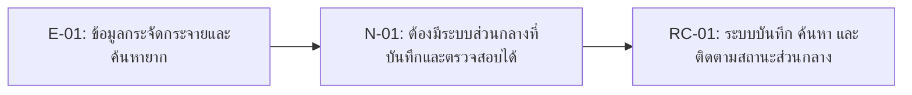

# 04 — Requirement Candidates: Campus Lost and Found

## 1. How We Turned Evidence into Requirement Candidates

หลักคิดของทีม:

1. เริ่มจาก evidence ที่มี E-ID
2. เขียน need เป็นปัญหา/เป้าหมายของ stakeholder
3. เขียน RC เป็น capability ของระบบ
4. ใส่ status เป็น `Candidate` หรือ `Needs Validation`
5. ระบุ follow-up ถ้ายังมี unknown

## 2. Requirement Candidate Table

| RC-ID | Requirement Candidate | Stakeholder / Need | Evidence E-ID(s) | Status | Follow-up |
|---|---|---|---|---|---|
| RC-01 | The system should provide a centralized database for officers to log, search, and track the status of lost and found items. | เจ้าหน้าที่ / N-01 | E-01 | Candidate | Verify data structure required |
| RC-02 | The system should allow users to submit private proof of ownership to officers for verification without displaying it publicly. | ผู้ทำของหาย, เจ้าหน้าที่ / N-02 | E-02 | Candidate | Confirm verification criteria |
| RC-03 | The system should implement role-based access control and image censorship tools to hide sensitive personal data from public view.| ผู้ดูแล IT, ผู้บริหาร / N-03 | E-03 | Candidate | Verify automated vs manual censor |
| RC-04 | The system should allow finders to report item locations anonymously and without taking physical possession of the item. | ผู้พบของ / N-04 | E-04 | Candidate | Confirm workflow for item retrieval |
| RC-05 | The system should generate reports and alerts for unclaimed items that exceed a specified retention period.  | ผู้บริหาร, เจ้าหน้าที่ / N-05 | E-05 | Needs Validation | Confirm unclaimed item policy |

## 3. Why These Are Candidates, Not Final Requirements

| RC | เหตุผลที่ยังไม่ final |
|---|---|
| RC-01 | ยังไม่ทราบโครงสร้างข้อมูลเดิมของมหาวิทยาลัยและกระบวนการจัดการพื้นที่จัดเก็บจริง |
| RC-02 | ยังไม่มีการกำหนดหลักเกณฑ์ที่ชัดเจนว่าหลักฐานประเภทใดจึงจะเพียงพอต่อการยืนยันตัวตนก่อนส่งมอบของ |
| RC-03 | ยังไม่สรุปว่าระบบจะบังคับเซ็นเซอร์ภาพแบบอัตโนมัติตั้งแต่ต้นทาง หรือต้องใช้เจ้าหน้าที่คอยตรวจสอบแบบกำหนดสิทธิ์|
| RC-04 | ยังไม่ทราบกระบวนการว่าหากผู้พบไม่เก็บของไว้กับตัว ใครจะเป็นผู้รับผิดชอบไปนำของเข้าสู่ส่วนกลาง |
| RC-05 | ยังไม่มีข้อกำหนดนโยบายจากผู้บริหารที่ชัดเจนเกี่ยวกับระยะเวลาในการเก็บสิ่งของที่ไม่มีผู้มารับ (Unclaimed items) |

## 4. Candidate to Week05 Backlog Handoff

| Week04 RC | Move to Week05? | Reason |
|---|---|---|
| RC-01 | Yes | เป็น Core flow ที่แก้ปัญหาหลักเรื่องเวลาและลดภาระงานให้เจ้าหน้าที่ |
| RC-02 | Yes | ช่วยป้องกันข้อพิพาททางกฎหมายและแก้ความกังวลเรื่องมิจฉาชีพสวมรอย |
| RC-03 | Yes | เป็นความต้องการที่จำเป็นขั้นวิกฤต (Critical) ต่อความปลอดภัยของข้อมูลส่วนบุคคล (PDPA)|
| RC-04 | Yes | เป็นฟีเจอร์หลักที่จะกระตุ้นให้ผู้พบของยินดีที่จะใช้ระบบเพื่อแจ้งเบาะแสมากขึ้|
| RC-05 | Revise after validation | ต้องรอความชัดเจนด้านการร่างกฎระเบียบนโยบายการจัดการของตกค้างจากผู้บริหารเสียก่อน  |

## 5. Student Takeaway

ตัวอย่างนี้แสดงว่า RC ที่ดีควรตอบได้ว่า: 

* อ้าง evidence ไหน 
* แก้ need อะไร 
* ยังไม่รู้อะไร 
* จะตรวจต่อใน Week05 อย่างไร 