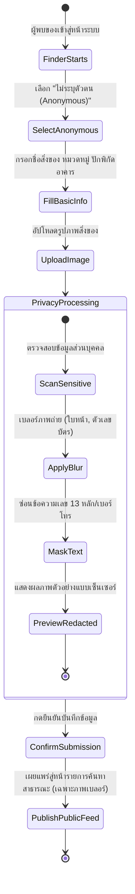

# 06 — Requirement Models: User Stories, Use Cases and Acceptance Criteria

> **Course:** ENGSE206 Software Engineering Studio  
> **Case:** Campus Lost and Found (Case-05)  
> **Deliverable:** Week 06 — Requirement Models and Negotiation  
> **Source Baseline:** `docs/05-requirement-backlog.md` (Baseline v1.0) & `docs/08-validation-traceability.md`  
> **Status:** Modeled & Validated  
> **Version:** 1.0  
> **Date:** 2026-08-25  

---

## 1. User Stories

ตารางความต้องการในรูปแบบ User Story ครอบคลุมผู้ใช้งานทุกบทบาทและจัดลำดับตาม MoSCoW เพื่อใช้เป็นแนวทางในการพัฒนาระบบและการทดสอบ

| ID | User Story | Priority | Linked Requirement | Acceptance Criteria |
|---|---|---|---|---|
| **US-01** | **As a** ผู้ทำของหาย,  **I want** กรอกแบบฟอร์มแจ้งของหายโดยระบุอย่างน้อย 3 ฟิลด์บังคับ (ชื่อสิ่งของ, หมวดหมู่, สถานที่สูญหาย),  **so that** ระบบสามารถบันทึกข้อมูลและนำไปใช้จับคู่เบื้องต้นกับสิ่งของที่มีผู้เก็บได้ | Must | `FR-CLF-02` | AC-01 |
| **US-02** | **As a** ผู้พบของ,  **I want** แจ้งเบาะแสและปักพิกัดสถานที่พบสิ่งของได้โดยไม่ต้องระบุชื่อหรือช่องทางติดต่อส่วนตัวสู่สาธารณะ,  **so that** ฉันสามารถช่วยส่งต่อข้อมูลนำของคืนเจ้าของได้โดยไม่ต้องกังวลเรื่องภาระความรับผิดชอบหรือการถูกรบกวน | Must | `FR-CLF-03`, `BR-CLF-01` | AC-02 |
| **US-03** | **As a** เจ้าหน้าที่ศูนย์รับของหาย,  **I want** บันทึก รับเข้า จ่ายออก ค้นหา และติดตามสถานะรายการสิ่งของในคลังส่วนกลางได้ภายใน 3 วินาที,  **so that** ลดความผิดพลาดในการส่งมอบสิ่งของและลดภาระงานในการค้นหาข้อมูล | Must | `FR-CLF-01` | AC-06, AC-04 |
| **US-04** | **As a** ผู้ทำของหาย,  **I want** แนบหลักฐานยืนยันความเป็นเจ้าของ (ไฟล์ไม่เกิน 10MB) ส่งตรงถึงเจ้าหน้าที่ผ่านช่องทางส่วนตัว,  **so that** ฉันสามารถพิสูจน์สิทธิ์รับของคืนได้โดยไม่เปิดเผยหลักฐานสำคัญสู่สาธารณะ และป้องกันมิจฉาชีพสวมรอย | Must | `FR-CLF-04`, `NFR-CLF-01` | AC-05 |
| **US-05** | **As a** เจ้าหน้าที่ศูนย์รับของหาย,  **I want** เปลี่ยนสถานะคำร้องยืนยันความเป็นเจ้าของ (pending, verified, rejected, returned) พร้อมบันทึกเหตุผลประกอบ,  **so that** มีหลักฐานการตรวจสอบและควบคุมกระบวนการส่งมอบสิ่งของจริงได้อย่างถูกต้อง | Must | `FR-CLF-05` | AC-06 |
| **US-06** | **As a** ผู้ดูแลระบบ IT / ผู้บริหาร,  **I want** ระบบปิดบังข้อมูลส่วนบุคคล (เลขบัตร, ข้อมูลติดต่อ) และเบลอร์ภาพถ่ายสิ่งของก่อนแสดงผลสู่สาธารณะ,  **so that** ระบบปฏิบัติตามกฎหมาย PDPA และป้องกันการละเมิดความเป็นส่วนตัวของผู้เกี่ยวข้อง | Must | `BR-CLF-01`, `NFR-CLF-01` | AC-03 |
| **US-07** | **As a** ผู้ใช้งาน (ผู้ทำของหาย/เจ้าหน้าที่),  **I want** กรองรายการสิ่งของตาม 3 เงื่อนไข (หมวดหมู่, สถานที่, ช่วงเวลา) และเห็นผลลัพธ์ไม่เกิน 5 คลิก,  **so that** ค้นหารายการสิ่งของที่ต้องการได้อย่างสะดวก รวดเร็ว และแม่นยำ | Should | `FR-CLF-06` | AC-04 |
| **US-08** | **As a** ผู้ทำของหาย (ผู้ยื่นคำร้อง),  **I want** ได้รับการแจ้งเตือนอัตโนมัติภายใน 1 นาทีเมื่อสถานะคำร้องของฉันมีการเปลี่ยนแปลง,  **so that** ฉันรับทราบความคืบหน้าได้ทันทีโดยไม่ต้องคอยติดต่อสอบถามเจ้าหน้าที่ซ้ำซ้อน | Should | `FR-CLF-07` | AC-07 |
| **US-09** | **As a** เจ้าหน้าที่ศูนย์รับของหาย / ผู้บริหาร,  **I want** รายงานสรุปรายการสิ่งของตกค้างในคลังเกิน 30 วันประจำสัปดาห์,  **so that** สามารถวางแผนบริหารจัดการพื้นที่คลังและดำเนินการตัดโอนตามนโยบายมหาวิทยาลัย | Should | `FR-CLF-08`, `ISSUE-CLF-01` | AC-08 |
| **US-10** | **As a** ผู้ใช้งานผ่านอุปกรณ์เคลื่อนที่,  **I want** ใช้งานระบบผ่านหน้าจอมือถือ (Responsive) ที่โหลดเสร็จภายใน 3 วินาทีบนเครือข่าย 4G,  **so that** สามารถแจ้งของหายหรือแจ้งพบของได้ทันที ณ จุดเกิดเหตุ | Should | `NFR-CLF-02` | AC-09 |

---

## 2. Acceptance Criteria

เกณฑ์การยอมรับเขียนด้วยรูปแบบ **Given-When-Then (Gherkin format)** ครอบคลุมทั้งกรณีทำงานปกติ (Positive), กรณีตรวจสอบความถูกต้อง (Validation), ความปลอดภัย (Security/Privacy) และกรณีเกิดข้อผิดพลาด (Negative)

### AC-01 — การตรวจสอบแบบฟอร์มแจ้งของหาย (Validation of Lost Item Form)
*เชื่อมโยง: `FR-CLF-02`, `US-01`*

#### Scenario 1.1: กรอกข้อมูลครบถ้วนทั้ง 3 ฟิลด์บังคับ (Success)
- **Given** ผู้ทำของหายเข้าสู่หน้าจอแบบฟอร์ม "แจ้งของหาย"
- **When** ผู้ทำของหายกรอกข้อมูลครบทั้ง 3 ฟิลด์บังคับ ได้แก่:
  - ชื่อสิ่งของ (Item Name)
  - หมวดหมู่สิ่งของ (Category)
  - สถานที่สูญหาย (Lost Location)  
  และกดปุ่ม "ส่งข้อมูลแจ้งของหาย"
- **Then** ระบบต้องบันทึกรายการเข้าสู่ฐานข้อมูลสถานะ `Active`
- **And** ระบบแสดงข้อความแจ้งเตือน "บันทึกข้อมูลแจ้งของหายสำเร็จ" พร้อมแสดงรหัสอ้างอิงคำร้อง (Report ID)

#### Scenario 1.2: ขาดฟิลด์บังคับใดฟิลด์หนึ่ง (Validation Error)
- **Given** ผู้ทำของหายอยู่ในหน้าจอแบบฟอร์ม "แจ้งของหาย"
- **When** ผู้ทำของหายเว้นว่างฟิลด์ใดฟิลด์หนึ่งใน 3 ฟิลด์บังคับ แล้วกดปุ่ม "ส่งข้อมูลแจ้งของหาย"
- **Then** ระบบต้องไม่อนุญาตให้ส่งฟอร์ม (Form submission blocked)
- **And** ระบบต้องแสดงข้อความเตือนสีแดงใต้ฟิลด์ที่เว้นว่างว่า "กรุณาระบุข้อมูลในช่องนี้ให้ครบถ้วน"

---

### AC-02 — การแจ้งเบาะแสและปักพิกัดพบของแบบไม่ระบุตัวตน (Anonymous Found Item & Tip-off)
*เชื่อมโยง: `FR-CLF-03`, `BR-CLF-01`, `US-02`*

#### Scenario 2.1: ผู้พบของแจ้งเบาะแสโดยไม่ระบุตัวตน (Success)
- **Given** ผู้พบของเข้ามายังหน้าจอ "แจ้งพบของ / แจ้งเบาะแส"
- **When** ผู้พบของเลือกตัวเลือก "ไม่เปิดเผยตัวตน (Anonymous)"
- **And** ผู้พบของระบุชื่อสิ่งของ หมวดหมู่ และปักหมุดพิกัดสถานที่พบสิ่งของบนแผนที่จำลองอาคาร
- **And** ผู้พบของกดปุ่ม "ส่งข้อมูลแจ้งพบของ"
- **Then** ระบบต้องบันทึกเบาะแสเข้าระบบโดยฟิลด์ `Finder Name` และ `Contact Info` เป็นค่าว่างหรือ `Anonymous`
- **And** ระบบสร้างรหัสรายการสิ่งของที่พบ (Found Item ID) และแสดงข้อความ "ขอบคุณสำหรับการแจ้งเบาะแส ข้อมูลถูกส่งเข้าสู่ระบบแล้ว"

#### Scenario 2.2: การซ่อนข้อมูลติดต่อของผู้พบของต่อสาธารณะ
- **Given** ผู้พบของกรอกข้อมูลติดต่อส่วนตัวเพื่อให้เจ้าหน้าที่ติดต่อกลับได้ในระบบหลังบ้าน
- **When** ผู้ใช้ทั่วไป (Public User) เข้ามาดูรายละเอียดของรายการสิ่งของที่พบชิ้นนี้
- **Then** ระบบต้องไม่แสดงชื่อ นามสกุล หมายเลขโทรศัพท์ หรืออีเมลของผู้พบของบนหน้ารายละเอียดสาธารณะโดยเด็ดขาด

---

### AC-03 — การปิดบังข้อมูลส่วนบุคคลและการเบลอร์ภาพถ่ายสาธารณะ (Privacy & Image Redaction)
*เชื่อมโยง: `BR-CLF-01`, `NFR-CLF-01`, `US-06`*

#### Scenario 3.1: การแสดงผลรูปภาพสิ่งของในมุมมองสาธารณะ
- **Given** มีการอัปโหลดรูปภาพสิ่งของที่พบเข้าสู่ระบบ
- **When** รูปภาพถูกนำไปแสดงผลบนหน้ารายการค้นหาสาธารณะ (Public Feed / Search Results)
- **Then** รูปภาพที่แสดงผลต้องเป็นภาพที่มีการเบลอร์ (Blurred/Masked) ในระดับที่มองไม่เห็นตัวเลขบัตรประจำตัว ใบหน้าบุคคล หรือข้อความส่วนบุคคล
- **And** เฉพาะเจ้าหน้าที่ศูนย์รับของหายที่เข้าสู่ระบบด้วยสิทธิ์ `Staff` เท่านั้นที่สามารถคลิกดูรูปภาพต้นฉบับความละเอียดสูงได้

#### Scenario 3.2: การป้องกันการระบุข้อมูลส่วนบุคคลอ่อนไหวในคำบรรยายสาธารณะ
- **Given** ผู้ใช้งานกรอกคำบรรยายสิ่งของ
- **When** ระบบตรวจพบรูปแบบตัวเลข 13 หลัก (เลขประจำตัวประชาชน) หรือหมายเลขโทรศัพท์ 10 หลักในฟิลด์คำบรรยาย
- **Then** ระบบต้องขึ้นข้อความแจ้งเตือน "เพื่อความปลอดภัยและความเป็นส่วนตัวตาม PDPA ระบบจะทำการซ่อนข้อมูลติดต่อ/เลขประจำตัวในส่วนแสดงผลสาธารณะ" และแปลงข้อมูลดังกล่าวเป็น `[ข้อมูลส่วนบุคคลถูกปกปิด]` ในมุมมองสาธารณะ

---

### AC-04 — การค้นหาและคัดกรองรายการสิ่งของ (Item Search & Filtering)
*เชื่อมโยง: `FR-CLF-06`, `US-07`*

#### Scenario 4.1: ค้นหาตามเงื่อนไข 3 ด้านไม่เกิน 5 คลิก (Usability Benchmark)
- **Given** ผู้ใช้งานอยู่ในหน้ารายการสิ่งของทั้งหมด
- **When** ผู้ใช้งานดำเนินการคัดกรองดังต่อไปนี้:
  1. คลิกเลือก "หมวดหมู่: อุปกรณ์อิเล็กทรอนิกส์" (คลิกที่ 1)
  2. คลิกเลือก "สถานที่: อาคารเรียนรวม 1" (คลิกที่ 2)
  3. คลิกเลือก "ช่วงเวลา: 7 วันที่ผ่านมา" (คลิกที่ 3)
  4. คลิกปุ่ม "ค้นหา" (คลิกที่ 4)
- **Then** ระบบต้องแสดงรายการสิ่งของที่ตรงกับทั้ง 3 เงื่อนไขพร้อมกัน
- **And** จำนวนการคลิกทั้งหมดต้องไม่เกิน 5 คลิก

#### Scenario 4.2: ประสิทธิภาพการแสดงผลการค้นหา (Performance Benchmark)
- **Given** ระบบมีรายการสิ่งของในฐานข้อมูลมากกว่า 1,000 รายการ
- **When** ผู้ใช้งานส่งคำค้นหาหรือตัวกรอง
- **Then** ระบบต้องประมวลผลและแสดงผลลัพธ์รายการบนหน้าจอภายในเวลาไม่เกิน 3 วินาที

---

### AC-05 — การส่งหลักฐานยืนยันความเป็นเจ้าของและจำกัดการเข้าถึง (Ownership Evidence Submission & Security)
*เชื่อมโยง: `FR-CLF-04`, `NFR-CLF-01`, `US-04`*

#### Scenario 5.1: แนบไฟล์หลักฐานขนาดไม่เกิน 10MB (Success)
- **Given** ผู้ทำของหายเข้าสู่กระบวนการ "ยื่นคำขอยืนยันความเป็นเจ้าของ" ของรายการสิ่งของที่พบ
- **When** ผู้ทำของหายอัปโหลดไฟล์ภาพหลักฐาน (เช่น รูปถ่ายคู่กับของ, ใบเสร็จ, ภาพหน้าจอยืนยัน Serial Number) ที่มีขนาด 8.5MB (น้อยกว่าหรือเท่ากับ 10MB)
- **And** กดปุ่ม "ส่งคำขอยืนยันสิทธิ์"
- **Then** ระบบต้องรับไฟล์ บันทึกคำขอเป็นสถานะ `Pending Verification`
- **And** แสดงข้อความ "ส่งหลักฐานสำเร็จ เจ้าหน้าที่จะทำการตรวจสอบข้อมูลของท่าน"

#### Scenario 5.2: แนบไฟล์หลักฐานขนาดเกิน 10MB (Size Exceeded)
- **Given** ผู้ทำของหายอยู่ในหน้ายื่นหลักฐาน
- **When** ผู้ทำของหายเลือกไฟล์หลักฐานที่มีขนาด 12MB
- **Then** ระบบต้องปฏิเสธไฟล์ทันทีก่อนการอัปโหลด (Client-side/Server-side validation)
- **And** แสดงข้อความเตือน "ขนาดไฟล์เกินกำหนด (สูงสุดไม่เกิน 10MB) กรุณาลดขนาดไฟล์แล้วลองใหม่อีกครั้ง"

#### Scenario 5.3: การจำกัดสิทธิ์เข้าถึงหลักฐาน (Role-Based Access Control)
- **Given** มีการยื่นหลักฐานยืนยันความเป็นเจ้าของเข้าสู่ระบบแล้ว
- **When** ผู้ใช้งานทั่วไป (Public) หรือผู้ใช้คนอื่นที่ไม่ใช่เจ้าของคำร้องและไม่ใช่เจ้าหน้าที่ พยายามเข้าถึง URL ไฟล์หลักฐาน
- **Then** ระบบต้องตอบกลับด้วยรหัสข้อผิดพลาด `403 Forbidden` หรือ `404 Not Found`
- **And** ไฟล์หลักฐานต้องเปิดดูได้เฉพาะผู้ยื่นคำร้องรายนั้น และเจ้าหน้าที่บทบาท `Staff` หรือ `IT Admin` เท่านั้น

---

### AC-06 — การตรวจสอบหลักฐานและการเปลี่ยนสถานะคำร้อง (Claim Verification & Handover)
*เชื่อมโยง: `FR-CLF-01`, `FR-CLF-05`, `US-03`, `US-05`*

#### Scenario 6.1: เจ้าหน้าที่ตรวจสอบหลักฐานผ่าน (Verify Claim)
- **Given** มีคำร้องสถานะ `Pending Verification` อยู่ในระบบ
- **When** เจ้าหน้าที่ศูนย์รับของหายเปิดดูหลักฐาน ตรวจสอบความถูกต้อง แล้วเลือกเปลี่ยนสถานะเป็น `Verified`
- **And** ระบุหมายเหตุนัดหมายรับของ เช่น "หลักฐานตรงกัน นัดรับของ ณ อาคารกิจกรรมนักศึกษา ชั้น 1"
- **Then** ระบบต้องอัปเดตสถานะคำร้องเป็น `Verified`
- **And** บันทึกประวัติการเปลี่ยนสถานะ (Audit Log) ระบุรหัสเจ้าหน้าที่ วันที่ และเวลา

#### Scenario 6.2: เจ้าหน้าที่ปฏิเสธคำร้องพร้อมบันทึกเหตุผล (Reject Claim)
- **Given** มีคำร้องสถานะ `Pending Verification` อยู่ในระบบ
- **When** เจ้าหน้าที่ตรวจสอบแล้วพบว่าหลักฐานไม่สอดคล้อง จึงเลือกเปลี่ยนสถานะเป็น `Rejected`
- **And** เจ้าหน้าที่ระบุเหตุผลบังคับ เช่น "ลักษณะตำหนิของสิ่งของไม่ตรงกับหลักฐานที่แนบมา"
- **Then** ระบบต้องอัปเดตสถานะคำร้องเป็น `Rejected` และจัดเก็บเหตุผลประกอบไว้ในระบบ

#### Scenario 6.3: เจ้าหน้าที่บันทึกการส่งมอบสิ่งของจริง (Handover Item)
- **Given** ผู้ทำของหายเดินทางมารับสิ่งของจริง ณ ศูนย์รับของหาย และคำร้องอยู่ในสถานะ `Verified`
- **When** เจ้าหน้าที่ตรวจสอบบัตรประจำตัวหน้างาน และกดปุ่ม "ยืนยันการส่งมอบสิ่งของ (Mark as Returned)"
- **Then** สถานะสิ่งของในคลังต้องเปลี่ยนเป็น `Returned` ทันที
- **And** รายการสิ่งของนั้นต้องถูกนำออกจากหน้ารายการค้นหาสิ่งของสาธารณะ (Public Feed) ภายใน 3 วินาที

---

### AC-07 — การแจ้งเตือนอัตโนมัติเมื่อสถานะคำร้องเปลี่ยนแปลง (Automated Notification)
*เชื่อมโยง: `FR-CLF-07`, `US-08`*

#### Scenario 7.1: การส่งแจ้งเตือนภายใน 1 นาที
- **Given** ผู้ทำของหายยื่นคำร้องไว้และระบุช่องทางแจ้งเตือน (Email หรือ In-app)
- **When** เจ้าหน้าที่เปลี่ยนสถานะคำร้องเป็น `Verified` หรือ `Rejected`
- **Then** ระบบต้องส่งสัญญาณแจ้งเตือนไปยังผู้ยื่นคำร้องโดยอัตโนมัติ
- **And** เวลาตั้งแต่เจ้าหน้าที่กดยืนยันสถานะจนถึงเวลาที่ระบบส่งข้อความแจ้งเตือนสำเร็จต้องไม่เกิน 60 วินาที

---

### AC-08 — การออกรายงานสิ่งของตกค้างเกินกำหนด (Unclaimed Items Reporting)
*เชื่อมโยง: `FR-CLF-08`, `ISSUE-CLF-01`, `US-09`*

#### Scenario 8.1: กรองและแสดงรายงานสิ่งของตกค้างเกิน 30 วัน
- **Given** มีสิ่งของในคลังที่อยู่ในสถานะ `In Storage` เกินกว่า 30 วันนับจากวันที่รับเข้า
- **When** เจ้าหน้าที่ศูนย์รับของหายเข้าสู่เมนู "รายงานสิ่งของตกค้าง (Unclaimed Items Report)"
- **Then** ระบบต้องแสดงรายการสิ่งของทั้งหมดที่มีอายุการจัดเก็บเกิน 30 วัน โดยแสดงรหัสสิ่งของ วันที่รับเข้า จำนวนวันที่จัดเก็บ และหมวดหมู่
- **And** มีปุ่มให้เจ้าหน้าที่สามารถส่งออกรายงานเป็นไฟล์ PDF/Excel เพื่อเสนอผู้บริหารพิจารณาตามรอบสัปดาห์

---

### AC-09 — ความเข้ากันได้และการโหลดบนอุปกรณ์เคลื่อนที่ (Mobile Responsiveness)
*เชื่อมโยง: `NFR-CLF-02`, `US-10`*

#### Scenario 9.1: การแสดงผลและเวลาโหลดหน้าจอบนเครือข่าย 4G
- **Given** ผู้ใช้งานเปิดหน้าจอหลักและแบบฟอร์มแจ้งของหายผ่านเว็บเบราว์เซอร์บนสมาร์ตโฟน (Viewport ความกว้าง 375px - 428px)
- **When** ทำการทดสอบโหลดหน้าจอผ่านการจำลองความเร็วเครือข่าย 4G (Fast 3G / 4G Profile)
- **Then** องค์ประกอบ UI ทุกส่วน (เมนู, ฟอร์ม, แผนที่ปักหมุด) ต้องจัดเรียงในแนวตั้งอย่างสมบูรณ์ ไม่มีการล้นหน้าจอด้านข้าง (Horizontal Scroll)
- **And** เวลาในการโหลดหน้าจอเสร็จสมบูรณ์ (Fully Loaded / Largest Contentful Paint) ต้องไม่เกิน 3.0 วินาที

---

## 3. Use Case List

| ID | Use Case Name | Primary Actor | Goal | Related Requirements | Diagram Reference |
|---|---|---|---|---|---|
| **UC-01** | Report Lost Item (แจ้งของหาย) | ผู้ทำของหาย (Lost Item Owner) | บันทึกข้อมูลและประกาศตามหาสิ่งของที่สูญหายในระบบส่วนกลาง | `FR-CLF-02` | [Use Case Diagram](#51-use-case-diagram) |
| **UC-02** | Report Found Item / Tip-off (แจ้งพบของ/แจ้งเบาะแส) | ผู้พบของ (Finder) | แจ้งเบาะแสและพิกัดที่พบสิ่งของเข้าระบบโดยไม่ต้องเปิดเผยตัวตน | `FR-CLF-03`, `BR-CLF-01` | [Use Case Diagram](#51-use-case-diagram) |
| **UC-03** | Search & Filter Found Items (ค้นหาและคัดกรองรายการสิ่งของ) | ผู้ใช้งานทั่วไป (Public / Requester) | ค้นหารายการสิ่งของที่สูญหายตามเงื่อนไขเพื่อตรวจสอบว่ามีผู้เก็บได้หรือไม่ | `FR-CLF-06`, `BR-CLF-01` | [Use Case Diagram](#51-use-case-diagram) |
| **UC-04** | Claim Ownership & Submit Evidence (ยื่นคำร้องและส่งหลักฐานยืนยันเจ้าของ) | ผู้ทำของหาย (Lost Item Owner) | ยื่นหลักฐานพิสูจน์สิทธิ์ความเป็นเจ้าของสิ่งของที่พบอย่างปลอดภัย | `FR-CLF-04`, `NFR-CLF-01` | [Use Case Diagram](#51-use-case-diagram) |
| **UC-05** | Verify Claim & Handover Item (ตรวจสอบสิทธิ์และส่งมอบสิ่งของคืน) | เจ้าหน้าที่ศูนย์รับของหาย (L&F Staff) | ตรวจสอบหลักฐาน อนุมัติ/ปฏิเสธคำร้อง และบันทึกส่งมอบสิ่งของจริง | `FR-CLF-01`, `FR-CLF-05` | [Use Case Diagram](#51-use-case-diagram) |
| **UC-06** | Manage Inventory & Unclaimed Items (จัดการคลังและติดตามสิ่งของตกค้าง) | เจ้าหน้าที่ศูนย์รับของหาย (L&F Staff) | บันทึกรับเข้าสิ่งของในคลัง และสรุปรายงานของตกค้างเกินกำหนดเสนอผู้บริหาร | `FR-CLF-01`, `FR-CLF-08`, `ISSUE-CLF-01` | [Use Case Diagram](#51-use-case-diagram) |

---

## 4. Use Case Specifications

ลงรายละเอียดข้อกำหนดการใช้งานสำหรับ Use Cases หลักที่ทำหน้าที่เป็นกระดูกสันหลังของระบบและมีความเสี่ยงสูง

### UC-04 — Claim Ownership & Submit Evidence (ยื่นคำร้องและส่งหลักฐานยืนยันเจ้าของ)

| Field | Detail |
|---|---|
| **Use Case ID** | **UC-04** |
| **Use Case Name** | Claim Ownership & Submit Evidence (ยื่นคำร้องและส่งหลักฐานยืนยันเจ้าของ) |
| **Primary Actor** | ผู้ทำของหาย (Lost Item Owner / Requester) |
| **Supporting Actors** | ระบบยืนยันตัวตนมหาวิทยาลัย (University Identity Service), ระบบแจ้งเตือน (Notification Service) |
| **Trigger** | ผู้ทำของหายค้นพบรายการสิ่งของที่เชื่อว่าเป็นของตนเอง และคลิกปุ่ม "ยื่นขอรับของคืน (Claim Item)" |
| **Preconditions** | 1. รายการสิ่งของนั้นอยู่ในสถานะ `In Storage` หรือ `Reported` และยังไม่ถูกส่งมอบคืน (`Returned`)  2. ผู้ทำของหายเข้าสู่ระบบผ่านการยืนยันตัวตนแล้ว |
| **Postconditions** | 1. ระบบสร้างคำขอยืนยันความเป็นเจ้าของใหม่ในสถานะ `Pending Verification`  2. ไฟล์หลักฐานถูกจัดเก็บอย่างปลอดภัยในโฟลเดอร์ส่วนตัวที่จำกัดสิทธิ์  3. รายการสิ่งของถูกผูกเข้ากับคำร้องใหม่ |
| **Related Requirements**| `FR-CLF-04`, `NFR-CLF-01`, `BR-CLF-01` |

#### Main Success Scenario (UC-04)
1. ผู้ทำของหายเลือกรวมรายการสิ่งของที่พบที่ตรงกับของตน และกดปุ่ม "ยื่นขอรับของคืน"
2. ระบบแสดงแบบฟอร์มยื่นคำร้อง พร้อมระบุข้อมูลอ้างอิงของสิ่งของ (รหัส, หมวดหมู่, วันที่พบ)
3. ผู้ทำของหายกรอกคำอธิบายจุดเด่น/ตำหนิเฉพาะตัวของสิ่งของที่ไม่ปรากฏในข้อมูลสาธารณะ
4. ผู้ทำของหายอัปโหลดไฟล์หลักฐานยืนยันความเป็นเจ้าของ (ขนาดไม่เกิน 10MB) เช่น ภาพถ่ายขณะใช้งาน, ใบเสร็จ หรือหลักฐานการซื้อ
5. ผู้ทำของหายกดยืนยันการส่งคำร้อง
6. ระบบตรวจสอบขนาดและนามสกุลไฟล์หลักฐาน
7. ระบบบันทึกคำร้องเข้าสู่ฐานข้อมูลสถานะ `Pending Verification`
8. ระบบส่งการแจ้งเตือนไปยังคิวงวดงานของเจ้าหน้าที่ศูนย์รับของหาย
9. ระบบแสดงข้อความยืนยันการยื่นคำร้องสำเร็จ พร้อมรหัสติดตามคำร้อง (Claim Ticket ID)

#### Alternate / Exception Flows (UC-04)
- **4a. ไฟล์หลักฐานมีขนาดเกิน 10MB:**
  - 4a1. ระบบปฏิเสธการอัปโหลด แจ้งเตือนผู้ใช้ว่า "ไฟล์มีขนาดเกิน 10MB"
  - 4a2. ผู้ทำของหายบีบอัดไฟล์หรือเลือกไฟล์ใหม่ แล้วกลับสู่ขั้นตอนที่ 4
- **4b. ไฟล์เป็นรูปแบบที่ไม่รองรับ (ไม่ใช่ JPG, PNG, PDF):**
  - 4b1. ระบบแสดงข้อความแจ้งเตือน "รองรับเฉพาะไฟล์รูปภาพ (JPG, PNG) หรือไฟล์ PDF เท่านั้น"
  - 4b2. ผู้ทำของหายเลือกไฟล์ที่ถูกต้อง แล้วกลับสู่ขั้นตอนที่ 4
- **7a. มีคำร้องของสิ่งของชิ้นนี้อยู่ระหว่างรอตรวจสอบแล้วโดยผู้ใช้อื่น:**
  - 7a1. ระบบอนุญาตให้ยื่นซ้อนได้ แต่บันทึกเป็นคิวที่สอง และแจ้งเตือนเจ้าหน้าที่ว่ามีคำร้องซ้ำซ้อนสำหรับสิ่งของชิ้นเดียวกัน

---

### UC-05 — Verify Claim & Handover Item (ตรวจสอบสิทธิ์และส่งมอบสิ่งของคืน)

| Field | Detail |
|---|---|
| **Use Case ID** | **UC-05** |
| **Use Case Name** | Verify Claim & Handover Item (ตรวจสอบสิทธิ์และส่งมอบสิ่งของคืน) |
| **Primary Actor** | เจ้าหน้าที่ศูนย์รับของหาย (Lost & Found Staff) |
| **Supporting Actors** | ผู้ทำของหาย (Claimant), ระบบแจ้งเตือน (Notification Service) |
| **Trigger** | เจ้าหน้าที่เปิดรายการคำร้องใหม่จากแดชบอร์ดคำร้องรอตรวจสอบ (Pending Queue) |
| **Preconditions** | 1. เจ้าหน้าที่เข้าสู่ระบบด้วยสิทธิ์ `Staff`  2. มีคำร้องในสถานะ `Pending Verification` |
| **Postconditions** | 1. สถานะคำร้องเปลี่ยนเป็น `Verified` หรือ `Rejected` พร้อมบันทึกเหตุผล  2. เมื่อมีการรับของจริง สถานะสิ่งของเปลี่ยนเป็น `Returned`  3. รายการสิ่งของถูกปิดการแสดงผลจากฟีดสาธารณะ |
| **Related Requirements**| `FR-CLF-01`, `FR-CLF-05`, `FR-CLF-07`, `NFR-CLF-01` |

#### Main Success Scenario (UC-05)
1. เจ้าหน้าที่เลือกคำร้องสถานะ `Pending Verification` จากตารางงาน
2. ระบบแสดงข้อมูลคำร้อง รายละเอียดตำหนิที่ผู้ใช้ระบุ และเปิดไฟล์หลักฐานให้เจ้าหน้าที่ดูแบบส่วนตัว
3. เจ้าหน้าที่เปรียบเทียบหลักฐานกับสิ่งของจริงที่เก็บรักษาอยู่ในตู้คลังส่วนกลาง
4. เจ้าหน้าที่ตัดสินว่าหลักฐานถูกต้อง สอดคล้องกับสิ่งของจริง
5. เจ้าหน้าที่เลือกสถานะ `Verified` และระบุสถานที่และวันเวลาทำการให้นัดรับของ
6. ระบบบันทึกการเปลี่ยนสถานะ และบันทึก Audit Log ของเจ้าหน้าที่
7. ระบบส่งการแจ้งเตือนอัตโนมัติไปยังผู้ทำของหายภายใน 1 นาที
8. เมื่อผู้ทำของหายเดินทางมาติดต่อรับของ เจ้าหน้าที่ตรวจสอบบัตรประจำตัวตัวจริง
9. เจ้าหน้าที่กดปุ่ม "บันทึกการส่งมอบสิ่งของ (Mark as Returned)" ในระบบ
10. ระบบเปลี่ยนสถานะสิ่งของเป็น `Returned` นำออกจากรายการค้นหาสาธารณะ และออกใบรับของดิจิทัล

#### Alternate / Exception Flows (UC-05)
- **4a. หลักฐานไม่ถูกต้องหรือไม่ชัดเจน (Claim Rejected):**
  - 4a1. เจ้าหน้าที่เลือกสถานะ `Rejected`
  - 4a2. ระบบบังคับให้เจ้าหน้าที่กรอก "เหตุผลในการปฏิเสธคำร้อง"
  - 4a3. เจ้าหน้าที่กรอกเหตุผลและกดยืนยัน
  - 4a4. ระบบบันทึกสถานะ `Rejected` และส่งแจ้งเตือนเหตุผลไปยังผู้ยื่นคำร้อง
  - 4a5. สิ่งของยังคงอยู่ในคลังและแสดงในฟีดสาธารณะต่อไป จบ Use Case
- **8a. ผู้มารับของไม่ใช่คนเดียวกับผู้ยื่นคำร้อง และไม่มีใบมอบอำนาจ:**
  - 8a1. เจ้าหน้าที่ปฏิเสธการส่งมอบสิ่งของจริงหน้างาน
  - 8a2. เจ้าหน้าที่บันทึกหมายเหตุ "บุคคลมารับของไม่ตรงกับข้อมูลผู้ยื่นคำร้อง" ไว้ในระบบ จบ Use Case

---

### UC-02 — Report Found Item / Tip-off & Privacy Handling (แจ้งพบของ/แจ้งเบาะแส)

| Field | Detail |
|---|---|
| **Use Case ID** | **UC-02** |
| **Use Case Name** | Report Found Item / Tip-off & Privacy Handling |
| **Primary Actor** | ผู้พบของ (Finder) |
| **Supporting Actors** | ระบบประมวลผลภาพ (Image Redaction Component) |
| **Trigger** | ผู้พบของพบสิ่งของตกหล่นในมหาวิทยาลัยและต้องการแจ้งเข้าสู่ระบบ |
| **Preconditions** | ผู้พบของเข้าถึงหน้าระบบ Campus Lost and Found |
| **Postconditions** | ข้อมูลสิ่งของถูกบันทึกเข้าสู่ระบบ โดยข้อมูลส่วนบุคคลถูกปกปิด และภาพสาธารณะถูกเบลอร์ |
| **Related Requirements**| `FR-CLF-03`, `BR-CLF-01`, `NFR-CLF-02` |

#### Main Success Scenario (UC-02)
1. ผู้พบของเข้าสู่หน้า "แจ้งพบสิ่งของ / เบาะแส"
2. ผู้พบของเลือกลักษณะการแจ้ง: "แจ้งเบาะแสโดยไม่เปิดเผยตัวตน (Anonymous)"
3. ผู้พบของระบุชื่อสิ่งของ หมวดหมู่ และเลือกตำแหน่งอาคาร/ชั้นที่พบสิ่งของจากแผนที่จำลอง
4. ผู้พบของถ่ายภาพสิ่งของและอัปโหลดเข้าสู่ระบบ
5. ระบบนำภาพเข้าสู่กระบวนการเบลอร์/เซ็นเซอร์ส่วนที่เป็นข้อมูลส่วนบุคคล (PDPA Redaction)
6. ผู้พบของตรวจสอบตัวอย่างภาพที่ผ่านการเบลอร์และกดยืนยันส่งข้อมูล
7. ระบบบันทึกข้อมูลสิ่งของเข้าสู่สถานะ `Reported / Tip-off`
8. ระบบแสดงข้อความขอบคุณและออกรหัสอ้างอิงเบาะแส

#### Alternate / Exception Flows (UC-02)
- **2a. ผู้พบของประสงค์นำของไปส่งให้เจ้าหน้าที่ที่จุดรับฝากด้วยตนเอง:**
  - 2a1. ผู้พบของเลือกตัวเลือก "นำส่งของเข้าคลังส่วนกลาง"
  - 2a2. ระบบแสดงพิกัดจุดรับฝากของศูนย์รับของหายที่ใกล้ที่สุด
  - 2a3. เจ้าหน้าที่ ณ จุดรับฝากจะเป็นผู้ตรวจรับของและอัปเดตสถานะเป็น `In Storage`

---

## 5. Requirement Models / Diagrams

### 5.1 Use Case Diagram

ความสัมพันธ์ระหว่างกลุ่มผู้ใช้งานหลัก (Actors) กับ Use Cases ทั้งหมดของระบบ Campus Lost and Found:

*ลิงก์ไฟล์ไดอะแกรมและคำอธิบาย:* [Use Case Diagrams Directory](../diagrams/use-case/README.md)

---

### 5.2 Activity Diagrams (Workflow Modeling)

#### Workflow 1: กระบวนการพิสูจน์สิทธิ์และคืนของ (Ownership Claim & Verification Flow)

```mermaid
stateDiagram-v2
    [*] --> BrowseOrSearch: ผู้ทำของหายค้นพบสิ่งของในระบบ
    BrowseOrSearch --> SubmitClaim: กดปุ่ม "ยื่นขอรับของคืน (Claim)"
    
    state SubmitClaim {
        [*] --> InputDetails: กรอกตำหนิ/รายละเอียดเฉพาะตัว
        InputDetails --> UploadProof: อัปโหลดหลักฐาน (≤ 10MB)
        UploadProof --> CheckSize: ตรวจสอบขนาดไฟล์
        CheckSize --> UploadProof: ขนาดเกิน 10MB (เตือนให้เปลี่ยนไฟล์)
        CheckSize --> CompleteSubmission: ขนาดถูกต้อง (≤ 10MB)
        CompleteSubmission --> [*]
    }

    SubmitClaim --> PendingVerification: บันทึกสถานะ Pending Verification
    PendingVerification --> StaffReview: เจ้าหน้าที่ศูนย์ฯ เปิดตรวจหลักฐาน

    state StaffReview {
        [*] --> CompareData: ตรวจหลักฐาน vs สิ่งของจริง
        CompareData --> DecisionCheck: หลักฐานตรงกันหรือไม่?
        DecisionCheck --> ApproveClaim: หลักฐานสอดคล้องถูกต้อง
        DecisionCheck --> RejectClaim: หลักฐานไม่ชัดเจน/ไม่ถูกต้อง
    }

    RejectClaim --> RecordReason: ระบุเหตุผลในการปฏิเสธ
    RecordReason --> NotifyClaimant: ส่ง Notification แจ้งเหตุผล (ภายใน 1 นาที)
    NotifyClaimant --> [*]: จบกรณีปฏิเสธ

    ApproveClaim --> UpdateVerified: เปลี่ยนสถานะเป็น Verified
    UpdateVerified --> ScheduleHandover: นัดหมายผู้ยื่นคำร้องมารับของ
    ScheduleHandover --> NotifyClaimantVerified: ส่ง Notification แจ้งนัดรับของ
    NotifyClaimantVerified --> PhysicalVisit: ผู้ทำของหายมาพบเจ้าหน้าที่ ณ ศูนย์ฯ
    PhysicalVisit --> VerifyPhysicalID: เจ้าหน้าที่ตรวจบัตร ปชช./บัตรนักศึกษา
    VerifyPhysicalID --> MarkReturned: บันทึกส่งมอบของสำเร็จ (Returned)
    MarkReturned --> HideFromPublic: ปิดการแสดงผลจากฟีดสาธารณะ
    HideFromPublic --> [*]: การส่งมอบเสร็จสมบูรณ์
```

#### Workflow 2: กระบวนการแจ้งพบของและการคุ้มครองข้อมูลส่วนบุคคล (Found Item Intake & Privacy Redaction Flow)

*ลิงก์ไฟล์ไดอะแกรมและคำอธิบาย:* [Activity Diagrams Directory](../diagrams/activity/README.md)

---

## 6. Negotiation / Trade-off Notes

บันทึกการตัดสินใจ การประนีประนอมความต้องการ (Trade-offs) และรายการที่เลื่อนออกจาก Scope (Deferred Scope) ตามที่ผ่านการวิเคราะห์จาก `docs/04-evidence-log.md` (C-01, C-02, C-03) และ `docs/08-validation-traceability.md`:

### 1. นโยบายระยะเวลาจัดเก็บและตัดโอนสิ่งของตกค้าง (Retention Policy vs Storage Capacity)
- **ประเด็นขัดแย้ง (C-01):** ผู้บริหารต้องการเก็บรักษาสิ่งของไว้นานที่สุดเพื่อรักษาสิทธิ์นักศึกษา ในขณะที่เจ้าหน้าที่ศูนย์ฯ ประสบปัญหาพื้นที่คลังกายภาพจำกัดและต้องการกำหนดเวลาตัดโอนที่ชัดเจน
- **ข้อสรุปที่เลือก (Option C):** แยกประเภทสิ่งของในการจัดเก็บ (ของมีค่า/เอกสารสำคัญ 90 วัน, ของทั่วไป 30 วัน, ของเน่าเสียง่ายกำจัดทันที) โดยใน Week 06 ระบบจะพัฒนาฟังก์ชันสรุปรายงานสิ่งของตกค้างเกิน 30 วัน (`FR-CLF-08`) เพื่อเสนอผู้บริหาร
- **สิ่งที่เลื่อนออก (Deferred / ISSUE-CLF-01):** การตัดโอน/ทำลายสิ่งของอัตโนมัติยังไม่เปิดใช้งานในระบบจนกว่าผู้บริหารระดับสูงจะมีคำสั่งอนุมัตินโยบายระเบียบอย่างเป็นทางการ

### 2. การเบลอร์ภาพถ่ายสาธารณะ (Image Redaction: AI Auto-censor vs Manual Approval)
- **ประเด็นขัดแย้ง (C-02):** ความต้องการปฏิบัติตามกฎหมาย PDPA เพื่อป้องกันภาพใบหน้าหรือเลขบัตรประชาชนรั่วไหล สู่สาธารณะ เทียบกับงบประมาณและความซับซ้อนในการพัฒนาระบบ
- **ข้อสรุปที่เลือก (Option C - Baseline Implementation):** ระบบเลือกใช้กลไกผสมผสาน โดยให้ผู้ใช้อัปโหลดทำ Manual Crop/Blur ผ่านเครื่องมือหน้าเว็บเบื้องต้น และมีเจ้าหน้าที่ศูนย์รับของหายเป็นผู้ตรวจสอบความเรียบร้อยของภาพก่อนอนุมัติเผยแพร่สู่สาธารณะ (`BR-CLF-01`, `NFR-CLF-01`)
- **สิ่งที่เลื่อนออก (Deferred / ISSUE-CLF-02):** สถาปัตยกรรมระบบ Machine Learning / AI Computer Vision ในการเซ็นเซอร์ภาพอัตโนมัติถูกจัดเก็บเป็น Open Question และเลื่อนไปพิจารณาในระยะถัดไปเนื่องจากข้อจำกัดด้านงบประมาณและเวลาของนักศึกษา

### 3. การแจ้งเบาะแสแบบไม่ระบุตัวตน vs ภาระการเก็บของจริง (Finder Tip-off vs Physical Pickup)
- **ประเด็นขัดแย้ง (C-03):** ผู้พบของกลัวความรับผิดชอบและไม่อยากเปิดเผยตัวตน จึงต้องการเพียงปักหมุดพิกัดในระบบ ในขณะที่เจ้าหน้าที่ต้องการให้ของจริงถูกนำมาฝากไว้ที่ตู้คลังกลาง
- **ข้อสรุปที่เลือก:** บรรจุความต้องการให้ผู้พบของแจ้งพิกัดและข้อมูลเบาะแสแบบ Anonymous เป็น Must (`FR-CLF-03`) เพื่อกระตุ้นการมีส่วนร่วมของชุมชนมหาวิทยาลัย
- **สิ่งที่เลื่อนออก (Deferred / FR-CLF-09):** ฟังก์ชันส่งพิกัดให้ รปภ. หรือแม่บ้านประจำอาคารเดินไปเก็บของเข้าคลังแทนผู้พบของ ถูกจัดลำดับความสำคัญเป็น **Could** และยังไม่ทำในรุ่นแรก จนกว่าจะมีการตกลงโครงสร้างอัตรากำลังเจ้าหน้าที่กายภาพกับฝ่ายบริหารอาคาร
